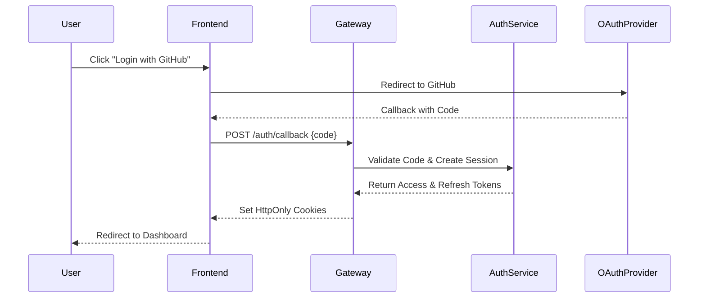
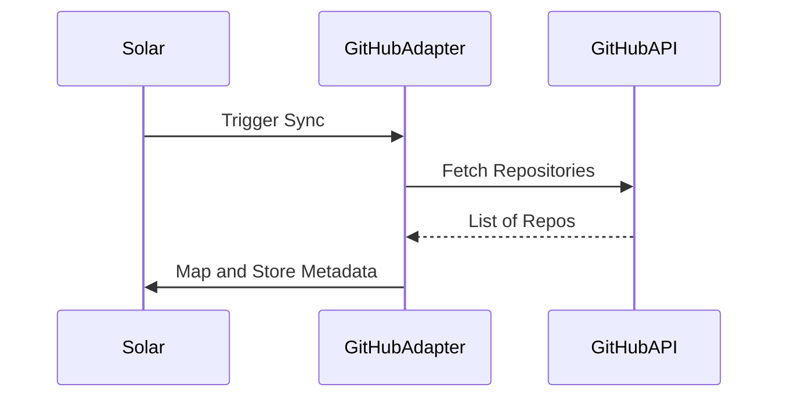

# API Design & Auth Flow

## Authentication Flow
Solar uses a stateless JWT-based authentication system with support for OAuth2 providers (GitHub, Google).

### Auth Flow Diagram

## API Structure (REST)

### Core Endpoints
-   `GET /api/v1/projects`: List all projects in organization.
-   `POST /api/v1/projects`: Create a new project.
-   `GET /api/v1/projects/:id/deployments`: Get deployment history.
-   `POST /api/v1/projects/:id/deploy`: Trigger a manual deployment.
-   `GET /api/v1/ai/chat`: Interface with AI orchestration.

### Internal Microservice Communication
-   Uses **gRPC** for high-performance internal calls between services.
-   Uses **NATS** or **Redis Pub/Sub** for asynchronous event-driven communication.

## Provider Integration Flow
Integration with external providers (GitHub, AWS, etc.) is handled via specialized adapters.

## Security
-   **Rate Limiting**: Applied at the Gateway level using Redis.
-   **API Keys**: Support for programmatic access via `X-Solar-API-Key`.
-   **CORS**: Strict origin checking.
