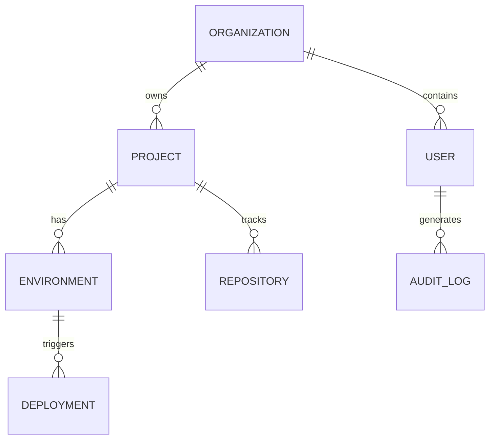

# Database Design

## Overview
Solar uses a multi-tenant architecture powered by PostgreSQL for persistent storage and Redis for high-speed caching and real-time messaging.

## Multi-tenant Strategy: Row-Level Security (RLS)
Every table includes a `tenant_id` or `organization_id` to ensure strict data isolation at the database level.

## Core Schema (PostgreSQL)

### 1. Organizations & Users
-   **Organizations**: `id`, `name`, `slug`, `plan_type`, `created_at`
-   **Users**: `id`, `email`, `full_name`, `avatar_url`, `created_at`
-   **Organization_Members**: `id`, `org_id`, `user_id`, `role` (OWNER, ADMIN, DEVELOPER)

### 2. Projects & Ecosystems
-   **Projects**: `id`, `org_id`, `name`, `description`, `repository_url`, `config_json`
-   **Environments**: `id`, `project_id`, `name` (prod, staging, dev), `variables_json`

### 3. Deployments & Hosting
-   **Deployments**: `id`, `project_id`, `env_id`, `status` (PENDING, BUILDING, DEPLOYED, FAILED), `commit_hash`, `logs_url`
-   **Hosts**: `id`, `org_id`, `provider` (AWS, GCP, VERCEL, SOLAR_HOST), `credentials_ref`

### 4. Events & Logs
-   **Audit_Logs**: `id`, `org_id`, `user_id`, `action`, `metadata`, `created_at`

## Cache & Real-time Schema (Redis)

### 1. Pub/Sub Channels
-   `org:{id}:events`: Global organization event stream.
-   `project:{id}:sync`: Real-time code and state synchronization.

### 2. State Management (Key-Value)
-   `session:{user_id}`: Active user session data.
-   `presence:org:{id}`: List of online users in an organization.
-   `lock:project:{id}`: Optimistic locking for collaborative editing.

## Database Flow Diagram

