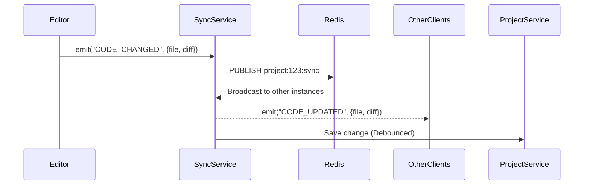

# Real-time Sync Engine

## Overview
The Sync Engine is the heart of Solar's "Central OS" functionality, ensuring all changes are propagated instantly across the ecosystem.

## WebSocket Event Flow
Using Socket.IO with a Redis adapter for horizontal scalability.

### Core Events
-   `CODE_CHANGED`: Fired when a file is edited in the Monaco editor.
-   `DEPLOYMENT_STARTED`: Notifies UI to show build progress.
-   `BUILD_FAILED`: Includes error logs for immediate debugging.
-   `ENV_UPDATED`: Triggers configuration refresh.
-   `USER_PRESENCE`: Tracks who is online in the workspace.

## Sync Workflow Diagram

## Event-Driven Architecture
Solar treats everything as an event. The system listens to internal and external triggers.

| Event | Source | Destination | Action |
| :--- | :--- | :--- | :--- |
| `GIT_PUSH` | GitHub Webhook | DeploymentSvc | Start Build |
| `BUILD_SUCCESS` | K8s Job | LogSvc / UI | Update Status |
| `AI_SUGGESTION` | AISvc | Editor | Show Ghost Text |
| `LOG_STREAM` | Pod Logs | LogSvc / UI | Stream to Console |

## Conflict Resolution
-   **Operational Transformation (OT)** or **CRDTs** (Conflict-free Replicated Data Types) will be used for collaborative editing.
-   Initial implementation will use **Last-Write-Wins (LWW)** with optimistic locking in Redis for simplicity in Phase 1.
